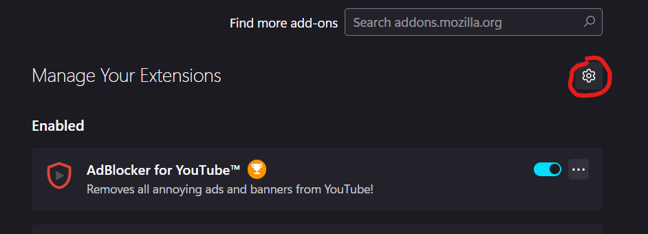

    <picture>
        <source media="(prefers-color-scheme: dark)" srcset="./ecstasea-dark.svg">
        
    </picture> 

<h1></h1>

### What is this?
A very simple new tab page extension meant to stay out of your way while still being a pleasant distraction for those who need something to look at while they think.

### Can I change the types of backgrounds I look at?
You can, just hit the reload button and you should get a new image!    
Don't wanna see the beaches and oceans anymore? You can go to the settings side panel and change the search query!

## Installation

### Installation from Source

  
Firefox

  1. Copy the `manifest.xpi.json` file to the `src` directory

  2. Rename it to `manifest.json`
  

  
3. Open your extension settings and click on the gear icon

  
  
  

  4. Click "Debug Add-ons"

  5. Click "Load temporary Add-on..." and find the `src` directory

  
Chromium

  1. Copy the `manifest.crx.json` file to the `src` directory

  2. Rename it to `manifest.json`
  
  3. Open your extension settings

  4. Toggle developer mode *(Usually located on the same page)*

  5. Click "Load unpacked" and find the `src` directory

### Build from Source
With Python installed, run `build.py` in your terminal with the argument of what type of extension you want.

Chromium: `python3 build.py crx`    
Firefox: `python3 build.py xpi`    
Both: `python3 build.py both` 

> *This has only been tested with Python 3.10.11 on Windows*
